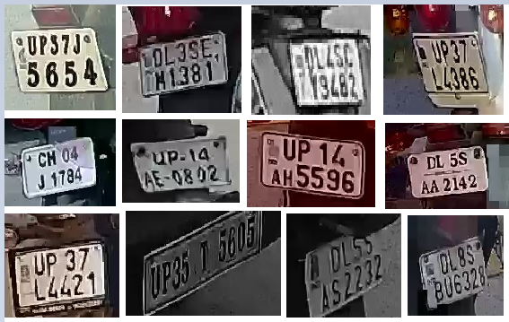

# Character Segmentation And Recognition

## Approach Workflow:
1. Image(Input)
2. Text/Character Segmentation
3. Denoising and Upscaling with Interpolation
4. Character Recognition
5. Saving to csv

# Solution
* The Dataset Contains 50 Mixed Images from Car,Two Wheelers and Posters. 
* On first look, most of the images don't need ROI filterings but after analysis, significant number of two wheeler images with a lot of background noise were found for which they need ROI filtering.

## Applying ROI Filtering 
* 

* For ROI Filtering, Warped Planar Object Detection Network was applied. WPOD-NET searches for License Plates and
regresses one affine transformation for detection detection, allowing a rectification of the LP area to a rectangle resembling a frontal view

* Here you can check the self-customized implementation of [WPOD-NET](scripts/Wpod_net_detection_Contour_segmentation.py) extended on [WPOD-NET Base](scripts/lpdr.py) and [LPDR Pretrained-Weights](weights/wpod_net_update1.h5)

## Results from ROI Filtering 

* 

* On results of ROI Filtering following techniques were applied: 
    * OpenCV customised thresholding
    * Connected Components
    * Contour Detection and Selection.
    * Debluring
    * Constrast
    * Transformation etc.

* Mentioned techniques can be observed in following images:

Since Dataset was mixed with around 50 samples in total it became harder for these naive methods to generalize. The extension to this is applying KNN models to characterise similar characters into a bucket and then assigning the value of the character based on the best image. Since the data provided was limited, moving into this way and verifying results became out of scope.

**Some new adjustments were made in order for model to work on this diverse and small dataset.**

## Analysis and Findings On Dataset
* While doing the explore study in terms of understanding the data distribution correctly including Contrast Adjustment Needs,occlusion,Spatial size for building the accurate approches for recognition. 
* Based on 50 images conclusion was drawn that ROI filtering and Text/Character Segmentation can be done by using Text Detection.

# Final Approach
* Finally, **Applied KerasOCR** for Character Detection and **Wraped Perspective Transform** for treating the tilt images were used.

* Text Detection after KerasOCR,

    
    
    

    
    
    

* After Analysis, KerasOCR's result were amplified by employing Tesseract for Final Recognition.

* Final Steps For Solution
    * Image
    * kerasOCR
    * Denoising
    * Upscaling(Interpolation)
    * Debluring
    * Tesseract
    * Results

* This whole apporach can be tested here : [Colab Notebook](https://colab.research.google.com/drive/1eW9oB2xpZgiK57uFFcMDoLH1hX6YlCIT?usp=sharing) or [here](scripts/Main.ipynb)

# [Final Results - Click for CSV](result.csv):
* 

* 

* 

* 

* 

* 

* 

# Further Scope and Improvements
* In some samples our approch is sometimes predicting Last 4 numbers in LC as characters because of distortion and low resolution and for the real world data which can be more noiser. So have found out SVHN housing number dataset which has more robust,occluded,low resolution and noisy data samples .Which will be perfect for recognising number

* Samples:

* 

* 

## Supporting Model and Weights 
* [Model](scripts/digit_recognition_svhn.ipynb)
* [Model-Weights](weights/my_model.h5)
* 
